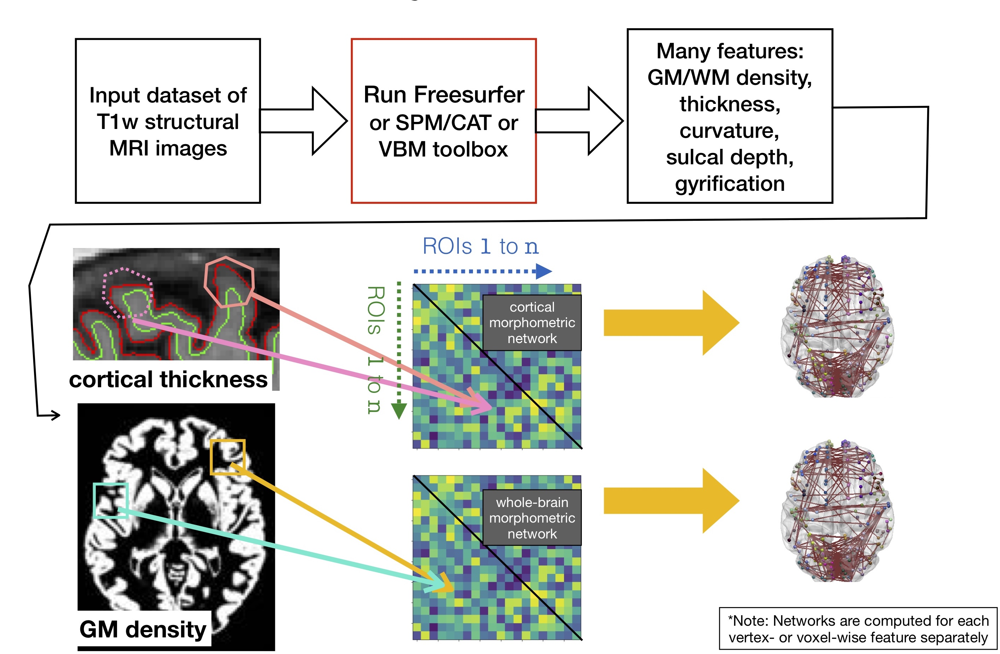

# graynet

Individualized single-subject networks from T1-weighted magnetic resonance imaging (MRI) features such as:
  - Cortical thickness.
  - Gray matter density.
  - Subcortical morphometric features.
  - Gyrification and curvature. 

Applicable for whenever network-level features are useful, among which common use cases are: 
 - Biomarker development.
 - Brain-behaviour relationships (e.g. for the diagnosis and prognosis of many brain disorders such as Alzheimer's, Parkinson's, Schizophrenia and the like).
 - Aging (changes in network properties over age and their relations to other variables).

Docs: https://raamana.github.io/graynet/

Quick illustration:

## Installation

`pip install -U graynet`

## Citation

If you found any parts of graynet to be useful in your research, I'd appreciate if you could cite the software paper in JOSS below, as well as the methods paper that motivated the tool development in that order:

 - Raamana et al., (2018). graynet: single-subject morphometric networks for neuroscience connectivity applications. Journal of Open Source Software, 3(30), 924, https://doi.org/10.21105/joss.00924
 - Raamana, P.R. and Strother, S.C., 2017, Impact of spatial scale and edge weight on predictive power of cortical thickness networks bioRxiv 170381 http://www.biorxiv.org/content/early/2017/07/31/170381.
 - Raamana, P. R., Weiner, M. W., Wang, L., Beg, M. F., & Alzheimer's Disease Neuroimaging Initiative. (2015). Thickness network features for prognostic applications in dementia. Neurobiology of aging, 36, S91-S102. https://www.sciencedirect.com/science/article/pii/S0197458014005521

---

