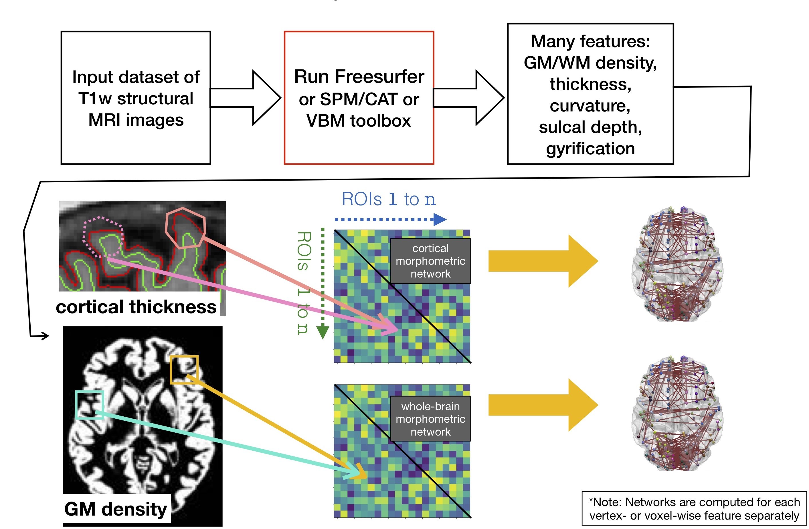

# graynet

[](https://doi.org/10.21105/joss.00924)

graynet builds single-subject morphometric brain networks from structural neuroimaging features such as cortical thickness, curvature, and volumetric gray-matter density.

It is designed for neuroscience workflows where you want to turn subject-level anatomical measurements into ROI-wise edge weights or ROI summary statistics that can then be used for visualization, statistical modeling, or machine learning.

Documentation: [https://raamana.github.io/graynet/](https://raamana.github.io/graynet/)

## Overview

graynet is useful when you want a subject-specific network representation of spatially distributed measurements over the brain.

Typical use cases:

- biomarker development
- disease classification or prognosis
- brain-behavior association studies
- aging and lifespan analyses
- network summaries derived from cortical or volumetric structural features

Supported feature families currently include:

- cortical Freesurfer features such as thickness and curvature
- volumetric CAT12/SPM-derived features such as gray-matter density



## New In The Current Release

This release rewrites much of the library to make graynet more practical for larger datasets.

- faster and simpler processing flow
- run-level outputs instead of many small subject-level files
- Parquet as the canonical storage format for downstream analysis
- explicit metadata for reproducible reconstruction of graphs and matrices
- CLI organized around subcommands: `edges`, `multiedge`, `roi-stats`, and `export`

Important migration note:

- this version does **not** offer backward compatibility with the previous output layout
- if you need old-style GraphML or CSV, use the provided export utilities
- if you need exact continuity with previous downstream pipelines, reprocess the dataset with the new version and update the downstream workflow accordingly

## Installation

```bash
pip install -U graynet
```

For development:

```bash
pip install -e ".[dev]"
```

## Canonical Outputs

Each run writes a single run directory named from the run-level configuration. Depending on the mode, the run directory contains:

- `run_metadata.json`
- `edges_raw.parquet`
- `edges_summary.parquet`
- `roi_stats.parquet`

Schema overview:

- `edges_raw.parquet`
  - `subject_id`
  - `base_feature`
  - `weight_method`
  - `u`
  - `v`
  - `weight`
- `edges_summary.parquet`
  - `subject_id`
  - `weight_method`
  - `summary_stat`
  - `u`
  - `v`
  - `weight`
- `roi_stats.parquet`
  - `subject_id`
  - `base_feature`
  - `stat_name`
  - `roi`
  - `value`

`run_metadata.json` captures the node order and run settings needed to reconstruct graphs and matrices deterministically.

## Working With Outputs In Python

The new outputs are meant to be easy to inspect directly in Python.

Read a run in one line:

```python
from graynet import load_run, get_edge_values, export_to_nx

edge_data, metadata = load_run("/path/to/run_dir")
```

Inspect metadata:

```python
print(metadata["atlas_name"])
print(metadata["base_features"])
print(metadata["weight_methods"])
print(len(metadata["node_labels"]))
```

Select one subject, one feature, one weight:

```python
subj_rows = get_edge_values(
    edge_data,
    subject_id="subject12345",
    base_feature="freesurfer_thickness",
    weight_method="manhattan",
)
```

Build a NetworkX graph in one line:

```python
graph = export_to_nx(subj_rows)
```

Iterate subject-wise:

```python
for subject_id, subject_edges in edge_data.iter_subjects():
    graph = export_to_nx(subject_edges)
    print(subject_id, graph.number_of_edges())
```

There is also a demo notebook for the 2.0 output model at [`scripts/demo_graynet_v2_outputs.ipynb`](scripts/demo_graynet_v2_outputs.ipynb).

## CLI Usage

### Single-edge networks

```bash
graynet edges \
  -i example_data/freesurfer \
  -s example_data/freesurfer/list_subjects.txt \
  -f freesurfer_thickness \
  -w manhattan euclidean \
  -a fsaverage \
  -o /tmp/graynet_runs
```

### Multi-edge networks

```bash
graynet multiedge \
  -i example_data/freesurfer \
  -s example_data/freesurfer/list_subjects.txt \
  -f freesurfer_thickness freesurfer_curv \
  -w manhattan cosine \
  -t median prod \
  -a fsaverage \
  -o /tmp/graynet_runs
```

### ROI summary statistics

```bash
graynet roi-stats \
  -i example_data/freesurfer \
  -s example_data/freesurfer/list_subjects.txt \
  -f freesurfer_thickness \
  -r median mean std \
  -a fsaverage \
  -o /tmp/graynet_runs
```

### Export derived formats

```bash
graynet export graphml --run-dir /tmp/graynet_runs/<run_name>
graynet export csv --run-dir /tmp/graynet_runs/<run_name>
```

## Python API

```python
from graynet import extract, roiwise_stats_indiv, extract_multiedge

edges = extract(
    ["subject12345"],
    "example_data/freesurfer",
    base_feature="freesurfer_thickness",
    weight_method_list=["manhattan"],
    atlas="fsaverage",
    return_results=True,
)

roi_stats = roiwise_stats_indiv(
    ["subject12345"],
    "example_data/freesurfer",
    base_feature="freesurfer_thickness",
    chosen_roi_stats=["median", "mean"],
    atlas="fsaverage",
    return_results=True,
)

multiedge = extract_multiedge(
    ["subject12345"],
    "example_data/freesurfer",
    base_feature_list=["freesurfer_thickness", "freesurfer_curv"],
    weight_method_list=["manhattan"],
    summary_stats=["median"],
    atlas="fsaverage",
    return_results=True,
)
```

When `return_results=False`, the API writes canonical run outputs and returns the run directory path.

## Domain Behavior Preserved

The 2.0 rewrite keeps the domain logic that made graynet useful in the first place:

- cortical and volumetric feature families remain distinct
- background/null ROI masking still happens before computation
- atlas-specific ROI semantics are preserved
- built-in and custom atlas inputs are still supported
- predefined feature-specific edge ranges are still honored
- cortical subdivision via `node_size` remains available for supported fsaverage presets

## Development Notes

The redesign rationale and target output contract are documented in [`docs/output_redesign.md`](docs/output_redesign.md).

Current tests:

```bash
pytest -q
```

Static checks:

```bash
python3 -m pyflakes graynet
```

## Citation

If graynet is useful in your work, please cite the software paper first, followed by the methodological papers when relevant:

- Raamana et al., (2018). graynet: single-subject morphometric networks for neuroscience connectivity applications. Journal of Open Source Software, 3(30), 924. [https://doi.org/10.21105/joss.00924](https://doi.org/10.21105/joss.00924)
- Raamana, P. R., & Strother, S. C. (2020). Does size matter? Relationship between predictive power of single subject morphometric networks to spatial scale and edge weight. Brain Structure and Function, 225(8), 2475-2493. [https://doi.org/10.1007/s00429-020-02136-0](https://doi.org/10.1007/s00429-020-02136-0)
- Raamana, P. R., Weiner, M. W., Wang, L., Beg, M. F., & Alzheimer's Disease Neuroimaging Initiative. (2015). Thickness network features for prognostic applications in dementia. Neurobiology of Aging, 36, S91-S102. [https://www.sciencedirect.com/science/article/pii/S0197458014005521](https://www.sciencedirect.com/science/article/pii/S0197458014005521)
