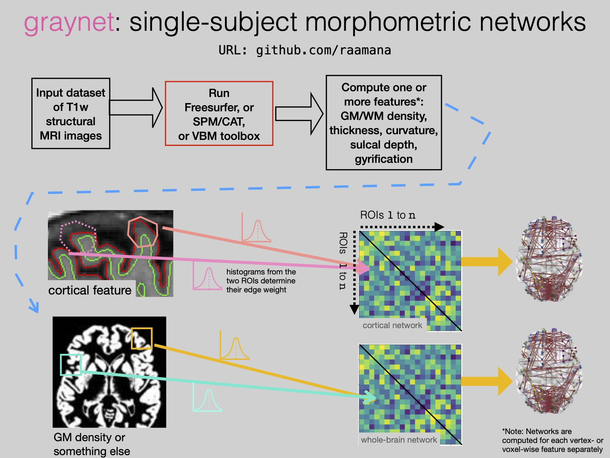

--------------------------------------------------------------------------------------------------
About
--------------------------------------------------------------------------------------------------

``graynet`` helps you easily extract single-subject network-level features from T1-weighted mri features, as well as ROI-wise statistics, such as:

  - Cortical thickness, Gyrification, Curvature, Sulcal depth etc
  - Gray/white matter density, or any other voxel-wise feature
  - Subcortical morphometric features

Applicable for whenever network-level features are useful, among which common use cases are:

 - Biomarker development
 - Brain-behaviour relationships e.g. for the diagnosis and prognosis of many brain disorders such as Alzheimer's, Parkinson's, Schizophrenia and the like
 - Aging (changes in network properties over age and their relations to other variables)
 - and any other applications wherein single-subject networks and ROI-stats are helpful.

Quick illustration (cortical version)
---------------------------------------

Applicability
-------------

This package can aid in understanding brain function (relationship of GM network-level features with behaviour) and in imaging biomarker development for the detection of many brain disorders such as Alzheimer's, Parkinson's, Schizophrenia and the like. The following publications show typical use cases:

 * Raamana, P.R. and Strother, S.C., 2017, Impact of spatial scale and edge weight on predictive power of cortical thickness networks bioRxiv 170381 http://www.biorxiv.org/content/early/2017/07/31/170381. doi: https://doi.org/10.1101/170381
 * Raamana, P. R., Wen, W., Kochan, N. A., Brodaty, H., Sachdev, P. S., Wang, L., & Beg, M. F. (2014). Novel ThickNet features for the discrimination of amnestic MCI subtypes. NeuroImage: Clinical, 6, 284-295. https://www.sciencedirect.com/science/article/pii/S0197458014005521
 * Tijms, B. M., Seriès, P., Willshaw, D. J., & Lawrie, S. M. (2012). Similarity-based extraction of individual networks from gray matter MRI scans. Cerebral Cortex, 22(7), 1530-1541.
 * Palaniyappan, L., Park, B., Balain, V., Dangi, R., & Liddle, P. (2015). Abnormalities in structural covariance of cortical gyrification in schizophrenia. Brain Structure and Function, 220(4), 2059-2071.
 * Xu, J., Zhang, J., Zhang, J., Wang, Y., Zhang, Y., Wang, J., ... & Zhang, Y. (2017). Abnormalities in structural covariance of cortical gyrification in Parkinson's disease. Frontiers in Neuroanatomy, 11.

Check the :doc:`usage_cli` and :doc:`API` pages, and let me know your comments.

Thanks for checking out. Your feedback will be appreciated.